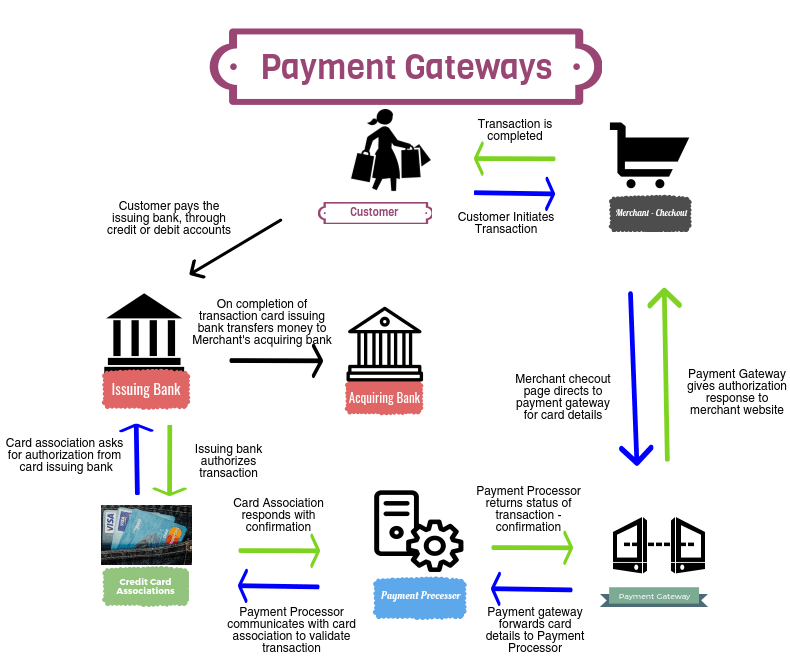

# gool-pay
Payment processing system API specific for web store clients. For training purpose only

## Prerequisites for back-end

You will need [Leiningen][] 2.0.0+, JVM (OpenJDK8+ or any other JVM provider) and Clojure 1.10.0+ installed


## Running

To start a web server for the application with inspection feature (for inspecting inline defs), follow these steps:

Start a nREPL session and connect to it via any REPL client with the port specified by nREPL

    lein repl

After loading all namespaces necessary to run the application's methods,
run the following commands:

- load the jetty module for the server

        (require '[ring.adapter.jetty :refer [run-jetty]])

- define a binding 'server' with the webserver port and startup

        (defonce server (run-jetty #'app {:port 3010 :join? false}))

- if you want to stop the server run this command to stop the server up & running

        (.stop server)

- to start it again

        (.start server)
    
- if you simply want to put the application to run but without inspection inline def

        lein ring server

You need to configure the database for development. In this case you need to create a MySQL database with the following configuration

    database: gool-pay
    host + port: localhost:3306
    user: root
    password: myuser

It will follow the configuration

```
(def db_connection_config {:classname "com.mysql.jdbc.Driver"
                           :subprotocol "mysql"
                           :subname "//localhost:3306/gool-pay"
                           :user "root"
                           :password "myuser"})
```

Test and validate the database connection with your preferred MySQL client

To call the endpoints, you can make HTTP requests with your preferred HTTP/REST APi Client.
The examples bellow via cURL

- register a new paynment
```
curl --request POST \
  --url http://localhost:3010/payments \
  --header 'content-type: application/json' \
  --data '{
	"user_id": 111,
	"store_id": 12,
	"payment_method": "offline",
	"card_brand": "cielo"
}'
```

- get the paymentes registered
```
curl --request GET \
  --url http://localhost:3010/payments
```


## The payment flow works as following:

1.  User chooses store and order item - then proceeds to checkout
2.  Specific payment methods are listed to the user, depending on the store configuration and risk analysis
3.  User chooses payment method and submits the order

**Task Instructions**

Implement a micro service to list available payment methods to the end user and process the payment request (steps #2 and #3).
Tasks

1.  Given a store id, return the payment methods (card brands) available for it, and return to the end user (list payments). Payments can be online (credit cards), or offline (cash, POS machines).
2.  Process a payment (mock external calls)

**Take a look at the steps of the follow illustration**




**Consider the following:**

1.  The service should be able to answer tens of thousands of requests per minute
2.  The configuration information does not change often
3.  The payment configuration depends on the store and the end user
4.  Available payment methods can be offline (cash, check, POS machine) or online (credit card or digital wallet)
5.  If the user requesting for the payment methods is a fraudster, the service should return only offline payment options
6.  Your data model should be flexible enough to permit cost ($) optimizations (should be easy to update)
7.  **Gateways often have outages**, but processing payments should continue working in these situations

**Additional information about the agents/actors/entities involved in our business domain**

1.  Gateway. External services responsible for processing the credit card transaction itself. It's a service between the e-commerce and the Acquirers. Usually a gateway doesn't process all payment brands. E.g., Cielo does not process Hipercard and Rede does not process ELO cards.
2.  Sub-acquirers or Providers. These are some full-featured gateways that are all-in-one: anti-fraud, gateway and acquirer, used to charge e-commerces with higher transactions fees.
3.  Acquirer. These are the companies that interact directly with issuers (banks) and payment brands (e.g. VISA).

**Costs**
**Each of the external services has a cost:**

1.  Gateway: fixed fee per transaction
2.  Acquirers: percentage of transaction amount
3.  Providers: percentage of transaction amount, already including anti-fraud and gateway.